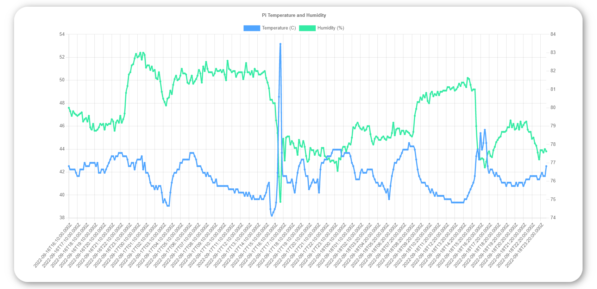

# Raspberry Pi Temperature and Humidity

This app can be used to measure temperature and humidity with a DHT11 or DHT22 sensor connected to your raspberry pi. 

With the DHT11/DHT22 sensor connected to your raspberrry pi on port GPIO 4, run humidityReader.py which will store data to a local database. Then run humidityServer.py as a separate process which will start a webserver to serve the temperature and humidity data.

